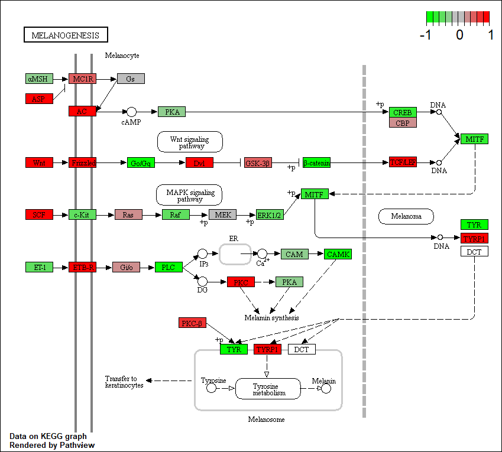

```{r setup, include=FALSE}
knitr::opts_chunk$set(echo = TRUE)
```

## RNA-Seq analysis

The data for for hands-on session comes from GEO entry: GSE37704, which is associated with the following publication:

>Trapnell C, Hendrickson DG, Sauvageau M, Goff L et al. "Differential analysis of gene regulation at transcript resolution with RNA-seq". *Nat Biotechnol* 2013 Jan;31(1):46-53. PMID: [23222703]("https://www.ncbi.nlm.nih.gov/pubmed/23222703")

```{r, results='hide'}
suppressMessages(library(DESeq2))
```

Load data files
```{r}
metaFile <- "GSE37704_metadata.csv"
countFile <- "GSE37704_featurecounts.csv"

# Import metadata and take a peak
colData = read.csv(metaFile, row.names=1)
head(colData)
```

```{r}
countData = read.csv(countFile, row.names=1)
head(countData)
```

Hmm... looks like we need to remove the first "length" column in the `countData` object

```{r}
# Note we need to remove the odd first $length col
countData <- as.matrix(countData[, -1])
head(countData)
```


```{r}
# Filter count data where you have 0 read count across all samples.
countData = countData[rowSums(countData[,]) != 0, ]
head(countData)
nrow(countData)
```

Nice now lets setup the DESeqDataSet object required for the DESeq() function and then run the DESeq pipeline. This is again similar to our last days hands-on session.

```{r, results = 'hide'}
dds = DESeqDataSetFromMatrix(countData = countData,
                             colData = colData,
                             design = ~condition)
dds = DESeq(dds)
```

Get our results

```{r}
res <- results(dds, contrast=c("condition", "hoxa1_kd", "control_sirna"))
```

```{r}
summary(res)
```

```{r}
mycols <- rep("gray", nrow(res) )
mycols[abs(res$log2FoldChange) > 2] <- "blue"
inds <- (-log(res$padj) < 4) & (abs(res$log2FoldChange) > 2 )
mycols[inds] <- "red"

plot(res$log2FoldChange, -log(res$padj), col = mycols, pch = 20)
abline(v = c(-2, 2), col = "green", lty = 2, lwd = 2)
abline(h = -log(0.0001), col = "green", lty = 2, lwd = 2)
```

```{r}
library("AnnotationDbi")
library("org.Hs.eg.db")

columns(org.Hs.eg.db)

res$symbol = mapIds(org.Hs.eg.db,
                    keys=row.names(res), 
                    keytype="ENSEMBL",
                    column="SYMBOL",
                    multiVals="first")

res$entrez = mapIds(org.Hs.eg.db,
                    keys=row.names(res),
                    keytype="ENSEMBL",
                    column="ENTREZID",
                    multiVals="first")

res$name =   mapIds(org.Hs.eg.db,
                    keys=row.names(res),
                    keytype="ENSEMBL",
                    column="GENENAME",
                    multiVals="first")

head(res, 10)
```

Write out our ordered and annotated results object
```{r}
res = res[order(res$pvalue),]
write.csv(res, file = "deseq_results.csv")
```

```{r}
library(pathview)
library(gage)
library(gageData)
```

```{r}
data(kegg.sets.hs)
data(sigmet.idx.hs)

# Focus on signaling and metabolic pathways only
kegg.sets.hs = kegg.sets.hs[sigmet.idx.hs]

# Examine the first 3 pathways
head(kegg.sets.hs, 3)
```

Create a vector of FoldChange values that has ENTREZ identifiers as the names of the vector. This is the format that the **gage()** function wants.

```{r}
foldchanges = res$log2FoldChange
names(foldchanges) = res$entrez
head(foldchanges)
```

Run the **gage()** function with this input
```{r}
# Get the results
keggres = gage(foldchanges, gsets=kegg.sets.hs)
```

Now lets look at the object returned from gage().

```{r}
attributes(keggres)
```

```{r}
head(keggres$less)
```

```{r}
pathview(gene.data=foldchanges, pathway.id="hsa04110")
```


```{r}
## Focus on top 5 upregulated pathways here for demo purposes only
keggrespathways <- rownames(keggres$greater)[1:5]

# Extract the 8 character long IDs part of each string
keggresids = substr(keggrespathways, start=1, stop=8)
keggresids
```

```{r}
pathview(gene.data=foldchanges, pathway.id=keggresids, species="hsa")
```





```{r}
data(go.sets.hs)
data(go.subs.hs)

# Focus on Biological Process subset of GO
gobpsets = go.sets.hs[go.subs.hs$BP]

gobpres = gage(foldchanges, gsets=gobpsets, same.dir=TRUE)

lapply(gobpres, head)
```

```{r}
sig_genes <- res[res$padj <= 0.05 & !is.na(res$padj), "symbol"]
print(paste("Total number of significant genes:", length(sig_genes)))
```

```{r}
write.table(sig_genes, file="significant_genes.txt", row.names=FALSE, col.names=FALSE, quote=FALSE)
```


